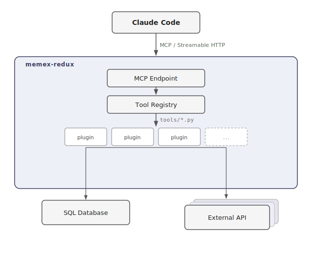

# memex-redux

A generic, extensible MCP server for Claude Code. Connect your own databases and APIs to Claude as tools — named as a homage to Vannevar Bush's 1945 essay envisioning a device for storing and linking all of a person's knowledge and experience.

---

## What it does

memex-redux runs a local HTTP server that exposes your personal data sources as [MCP tools](https://modelcontextprotocol.io). Claude Code connects to it and can then query your data directly in conversation — finance, health, climate, home automation, or anything else you want to hook up.

Tools are Python plugins in `tools/`. Drop a file there, restart the server, and Claude can use it. No registration step required.

---

## Architecture



---

## Stack

| Layer | Technology |
|---|---|
| Web framework | FastAPI |
| ASGI server | Uvicorn |
| MCP SDK | `mcp` (Anthropic) — `FastMCP`, Streamable HTTP |
| Database ORM | Peewee (optional) |
| Database | MariaDB (optional, read-only account) |
| HTTP client | requests |
| Frontend | Bootstrap 5 + vanilla JS |

---

## Repository structure

```
memex-redux/
├── core/
│   ├── server.py           # FastAPI app, MCP mount, lifespan
│   ├── tool_registry.py    # @tool decorator, auto-discovery of plugins
│   ├── db_connection.py    # Peewee initialisation
│   ├── http_connector.py   # Base class for HTTP data sources
│   └── call_log.py         # In-memory ring buffer (last 50 tool calls)
│
├── tools/                  # Your tool plugins — one file per data domain (gitignored)
│   ├── README.md
│   └── samples/            # Reference implementations — copy and adapt
│
├── tests/                  # Framework tests
│   └── samples/            # Reference tests for sample plugins
│
├── models.example.py       # Template — copy to models.py and adapt
├── config.example.json     # Template — copy to config.json and fill in
├── templates/
│   └── status.html         # Bootstrap 5 status UI
├── static/
│   ├── app.js
│   └── app.css
├── Dockerfile
├── create-container.sh
└── requirements.txt
```

> `config.json`, `models.py`, and `tools/*.py` are gitignored — they contain your credentials, schema, and personal tool plugins.

---

## Prerequisites

- Python 3.11+
- [Claude Code](https://docs.anthropic.com/en/docs/claude-code) CLI installed
- Docker (optional, for containerised deployment)
- A MariaDB/MySQL database (optional — only needed for database-backed tools)

---

## Setup

### 1. Clone and install dependencies

```bash
git clone https://github.com/xivind/memex-redux
cd memex-redux
pip install -r requirements.txt
```

### 2. Configure

```bash
cp config.example.json config.json
```

Edit `config.json`. The only required field is `server_port`:

```json
{
  "server_port": 8002
}
```

Add `api_domains` if your tools call external HTTP APIs:

```json
{
  "server_port": 8002,
  "api_domains": {
    "My Service": "http://my-service-host:8003"
  }
}
```

Add MariaDB credentials if your tools query a database. Use a dedicated read-only account (`SELECT` privileges only):

```json
{
  "server_port": 8002,
  "mariadb_host": "your-db-host",
  "mariadb_database": "your_database",
  "mariadb_user": "mcp_readonly",
  "mariadb_password": "your_password",
  "mariadb_port": 3306
}
```

### 3. Define your database models (only if using MariaDB)

```bash
cp models.example.py models.py
```

Edit `models.py` to define Peewee models matching your database tables. See the example file for common patterns: simple tables, tables without a primary key, and composite primary keys.

### 4. Add tool plugins

Create a `.py` file in `tools/`, import `mcp` from `core.tool_registry`, and decorate your functions. Copy from `tools/samples/` for a head start:

```python
from core.tool_registry import mcp

@mcp.tool(description="Recent transactions and account balances")
def get_finance(days: int = 30) -> list[dict]:
    from models import Transaction
    from datetime import datetime, timedelta
    cutoff = datetime.now() - timedelta(days=days)
    rows = Transaction.select().where(Transaction.record_time >= cutoff)
    return [{"date": str(r.record_time), "amount": r.amount} for r in rows]
```

The `description` is what Claude reads to decide which tool to call — write it as a natural question or task description.

### 5. Run

```bash
uvicorn core.server:app --host 0.0.0.0 --port 8002 --log-config uvicorn_log_config.ini
```

Or with Docker (edit the timezone in `create-container.sh` first):

```bash
./create-container.sh
```

A status page is available at `http://localhost:8002/` showing registered tools and recent calls.

---

## Connecting Claude Code

**User scope** — available across all your Claude Code projects:

```bash
claude mcp add --transport http --scope user memex-redux http://<host>:8002/mcp
```

**Project scope** — available only in the current project:

```bash
claude mcp add --transport http --scope project memex-redux http://<host>:8002/mcp
```

Replace `<host>` with the hostname or IP of the machine running the server (use `localhost` if running locally).

---

## HTTP-based tools

For data sources behind an API rather than a database, use `HttpConnector` with a base URL from `config.api_domains`:

```python
from core.db_connection import config
from core.http_connector import HttpConnector
from core.tool_registry import mcp

connector = HttpConnector(config.api_domains["My Service"])

@mcp.tool(description="Bike fleet status and maintenance schedule")
def get_bikes() -> list[dict]:
    return connector.get("/api/bikes")
```

---

## Constraints

- All tools are **read-only** by design. The database account has `SELECT` only.
- No authentication — assumes a trusted home network.
- Logging goes to stdout via uvicorn. No separate log config needed.
